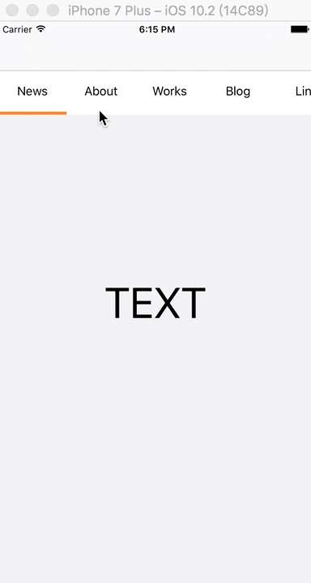
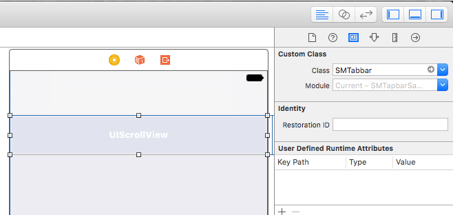

# SMTabbar
###### SMTabbar,a light component, just give it a String array and a callback function.


[](http://mit-license.org)




## Usage
Just drag 'SMTabbar.swift' to your project.
###### using Autolayout (Storyboard, XIB)

Create a UIScrollView in xib or storyboard,then change the view's class to "SMTabbar", 
and connect it to your viewController.



You have to add this line :
```swift
self.automaticallyAdjustsScrollViewInsets = false
```

Sample Code:

```swift
@IBOutlet var m_topBar: SMTabbar!
self.automaticallyAdjustsScrollViewInsets = false

let list : [String] = ["News","About","Works","Blog","Link","Contact Us"]

self.m_topBar.buttonWidth = 90
self.m_topBar.moveDuration = 0.4
self.m_topBar.fontSize = 16.0
self.m_topBar.configureSMTabbar(titleList: list) { (index) -> (Void) in
    print(index)
}


```swift
// the colorLine of posistion, default is bottom, you can set it to top.
self.m_topBar.linePosition = .top 
```
